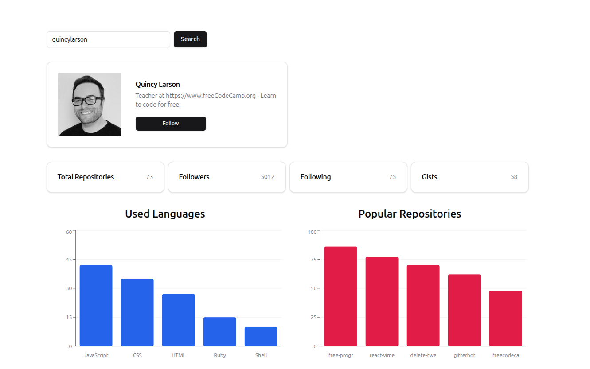

# GitHub GraphQL Explorer 🔍📊

<div align="center">
  
  
  
  
  
  
  
  
  
</div>

---

## 🚀 Live Demo

**View the live project here:**  
👉 [GitHub GraphQL Explorer - Live App](https://github-graphql-explorer-gpdev.netlify.app/)

> _Deployed with [Netlify](https://www.netlify.com/)_

---

## 📸 Project Preview

<table align="center">
  <tr>
    <td align="center"><strong>💻 Desktop View</strong></td>
  </tr>
  <tr>
    <td align="center">
      
    </td>
  </tr>

  <tr>
    <td align="center"><strong>📱 Mobile View</strong></td>
  </tr>
  <tr>
    <td align="center">
      
    </td>
  </tr>

  <tr>
    <td align="center"><em>Responsive design with Tailwind CSS and shadcn/ui components</em></td>
  </tr>
</table>

---

## 📘 About the Project

**GitHub GraphQL Explorer** is a learning project developed as part of my journey to explore the fundamentals of **GraphQL** and **Apollo Client**.
The app lets users search GitHub profiles and visualize repositories, followers, and language statistics — applying GraphQL concepts such as queries, variables, and schema-driven data fetching in a real-world context.

---

## 🎯 Learning Goals

This project is part of my React learning journey and focuses on `exploring modern data-fetching patterns` using **GraphQL** and **Apollo Client**.  
Through this app, I practiced:

- Understanding the fundamentals of **GraphQL queries**, variables, and schemas.
- Setting up **Apollo Client** in a **React + Vite + TypeScript** environment.
- Fetching data securely from the **GitHub GraphQL API** with authentication tokens.
- Defining **TypeScript types** for GraphQL responses to ensure full type safety.
- Building reusable UI components with **Tailwind CSS** and **shadcn/ui**.
- Displaying repository and profile statistics through **Recharts** visualizations.
- Improving user experience with **loading skeletons** and **toast notifications**.

---

## ✨ Features

- **User Search** — Quickly look up any GitHub user by username.
- **Profile Overview** — Displays avatar, name, bio, and a direct link to the GitHub profile.
- **Repository Statistics** — Shows total repositories, followers, following, and gists.
- **Data Visualizations** — Interactive charts built with **Recharts**:
  - Most used programming languages
  - Most starred repositories
  - Most forked repositories
- **GraphQL-Powered Queries** — Fetch only the necessary data from the GitHub API using **Apollo Client**.
- **Type-Safe Codebase** — Strong typing across GraphQL queries and components using **TypeScript**.
- **Modern UI** — Clean, responsive design built with **Tailwind CSS** and **shadcn/ui** components.
- **Enhanced UX** — Includes **toast notifications** for validation and **skeleton loaders** for smooth transitions.

---

## 🛠️ Built With

| Tool / Library               | Purpose                                            |
| ---------------------------- | -------------------------------------------------- |
| ⚛️ **React 18**              | Component-based UI framework                       |
| 🟦 **TypeScript 5.6.2**      | Type safety and improved developer experience      |
| ⚡ **Vite 5**                | Fast build tool and dev server                     |
| 🧩 **GraphQL 16.9.0**        | Query language for fetching GitHub data            |
| 🌐 **Apollo Client 3.11.10** | State management and GraphQL data fetching         |
| 🎨 **Tailwind CSS 3.4**      | Utility-first CSS framework for responsive styling |
| 🧱 **shadcn/ui**             | Accessible, customizable UI components             |
| 📊 **Recharts 2.x**          | Data visualization for repository insights         |
| 🧰 **@types/node**           | TypeScript definitions for Node.js environment     |

---

## 🎓 Key Learning Outcomes

- **GraphQL Fundamentals** — Learned how to construct queries with variables and select only the data needed from the GitHub API.
- **Apollo Client Integration** — Gained hands-on experience setting up Apollo Client in a React + Vite environment, managing queries, and handling loading/error states.
- **TypeScript & Type Safety** — Defined precise TypeScript types for GraphQL responses and props to maintain consistency and prevent runtime errors.
- **Reusable UI Components** — Built modular, reusable components with **shadcn/ui** and styled them using **Tailwind CSS**.
- **Data Visualization** — Implemented visual charts using **Recharts** to display popular repositories, forks, and language usage.
- **UX Enhancements** — Improved user interaction with **toast notifications**, **skeleton loaders**, and responsive layouts.
- **Environment Configuration** — Managed sensitive GitHub tokens securely using environment variables and `.env.local` files.

---

## 🏗️ Project Structure

```text
src/
|
├── components/
│   ├── charts/
│   │   ├── ForkedRepos.tsx        # Chart for most forked repositories
│   │   ├── PopularRepos.tsx       # Chart for most starred repositories
│   │   └── UsedLanguages.tsx      # Chart for most used programming languages
│   │
│   ├── form/
│   │   └── SearchForm.tsx         # Search input with toast validation
│   │
│   ├── ui/                        # shadcn/ui components
│   │   ├── button.tsx
│   │   ├── card.tsx
│   │   ├── chart.tsx
│   │   ├── input.tsx
│   │   ├── label.tsx
│   │   ├── skeleton.tsx
│   │   ├── toast.tsx
│   │   └── toaster.tsx
│   │
│   └── user/
│       ├── Loading.tsx            # Skeletons during data loading
│       ├── StatsCard.tsx          # Single stat display (followers, repos, etc.)
│       ├── StatsContainer.tsx     # Layout container for stats
│       ├── UserCard.tsx           # Displays avatar, name, bio, and GitHub link
│       └── UserProfile.tsx        # Main profile view fetching user data
│
├── hooks/
│   └── use-toast.ts               # shadcn custom hook for toast management
│
├── lib/
│   └── utils.ts                   # Utility functions for data calculations
│
├── apolloClient.ts                # Apollo Client setup (HTTP link, cache, errors)
├── queries.ts                     # GraphQL queries (GET_USER)
├── types.ts                       # TypeScript types for GraphQL data
├── App.tsx                        # Root component - integrates all features
├── main.tsx                       # Entry file - ApolloProvider + Toaster
├── vite-env.d.ts                  # TypeScript environment declarations
└── index.css                      # Global Tailwind imports
```

---

## 🚀 Getting Started

### Prerequisites

Before running this project, make sure you have:

- **Node.js** ≥ 18
- **npm** (or **yarn**) as your package manager
- A **GitHub Personal Access Token** (with `read:user` scope)

---

### Installation

1. **Clone the repository**

```bash
git clone https://github.com/pro804/github-graphql-explorer.git

```

2. **Navigate to the project folder**

```bash
cd github-graphql-explorer
```

3. **Install dependencies**

```bash
npm install
```

4. **Set up environment variables**

Create a `.env.local` file in the project root.

```bash
VITE_GITHUB_TOKEN=your_github_personal_access_token_here
```

⚠️ Keep this file private — never commit it to GitHub.
The token must have at least read:user permission.

5. **Run the development server**

```bash

npm run dev
```

6. **Open the app**

```bash

Go to http://localhost:5173 in your browser.

```

**Example** `.env.local`

```bash
# GitHub Personal Access Token
VITE_GITHUB_TOKEN=xxxxxxxxxxxxxxxxxxxxxx

```

| Command           | Description                          |
| ----------------- | ------------------------------------ |
| `npm run dev`     | Start the Vite development server    |
| `npm run build`   | Build the project for production     |
| `npm run preview` | Preview the production build locally |

---

## 🧪 How It Works (Data Flow)

The **GitHub GraphQL Explorer** follows a simple yet structured flow for fetching and displaying data:

1. **User Input**

   - The user types a GitHub username in the `SearchForm` and submits the form.
   - If the input is empty, a **toast notification** (via `shadcn/ui`) warns the user to enter a valid name.

2. **State Update**

   - The username is stored in a React state variable (`userName`) managed in `App.tsx`.

3. **GraphQL Query**

   - The `UserProfile` component uses the `useQuery` hook from **Apollo Client**.
   - It runs the `GET_USER` GraphQL query defined in `queries.ts`, passing the `userName` as a variable.

4. **Data Fetching & Error Handling**

   - While waiting for data, the `Loading` component shows **skeleton placeholders** for a smooth UX.
   - If an error occurs (e.g., user not found), a clear error message is displayed.

5. **Data Rendering**

   - On success, user data is displayed through:
     - `UserCard` — profile info (avatar, name, bio, link)
     - `StatsContainer` — numerical stats (repos, followers, gists)
     - `charts/` components (`UsedLanguages`, `PopularRepos`, `ForkedRepos`) — visual insights built with **Recharts**.

6. **Data Transformation**

   - Helper functions in `utils.ts` process repository data to calculate:
     - Top 5 languages used
     - Top 5 most starred repositories
     - Top 5 most forked repositories

7. **Visualization**
   - Processed data is rendered into **bar charts** via Recharts, styled consistently with Tailwind and shadcn UI.

## 📄 License

MIT — see [LICENSE](LICENSE) for details.

---

## 🙏 Acknowledgments

- [GitHub GraphQL API](https://docs.github.com/en/graphql)
- [Apollo Client](https://www.apollographql.com/docs/react/)
- [Shadcn UI](https://ui.shadcn.com/)
- [Tailwind CSS](https://tailwindcss.com/)
- [Vite](https://vite.dev/)
- Inspired by course work from [John Smilga](https://johnsmilga.com/)
